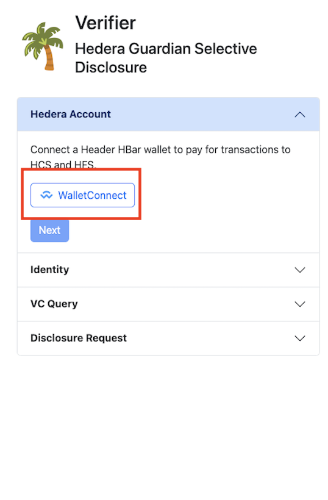
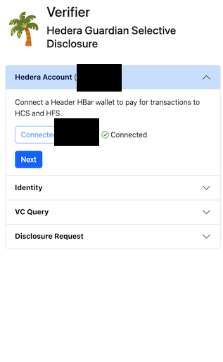
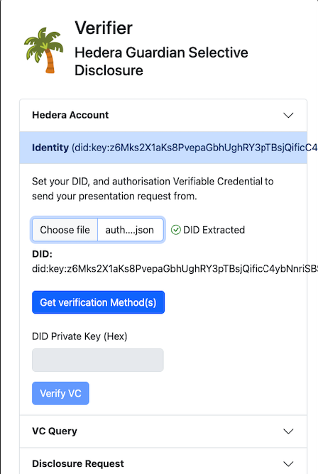
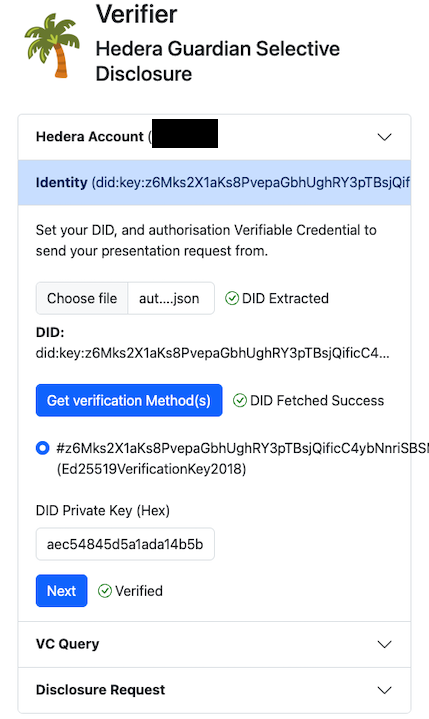
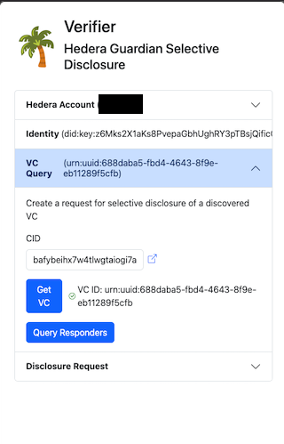
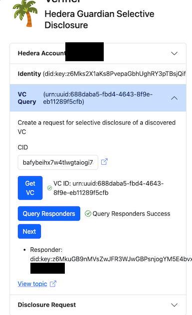
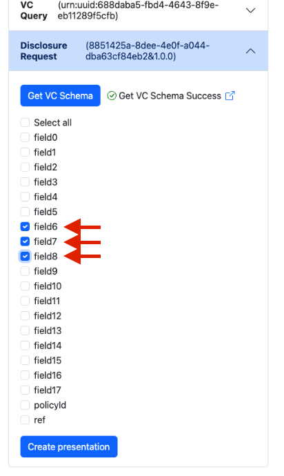
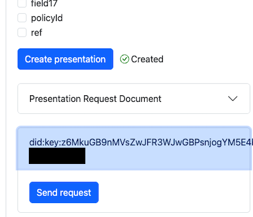
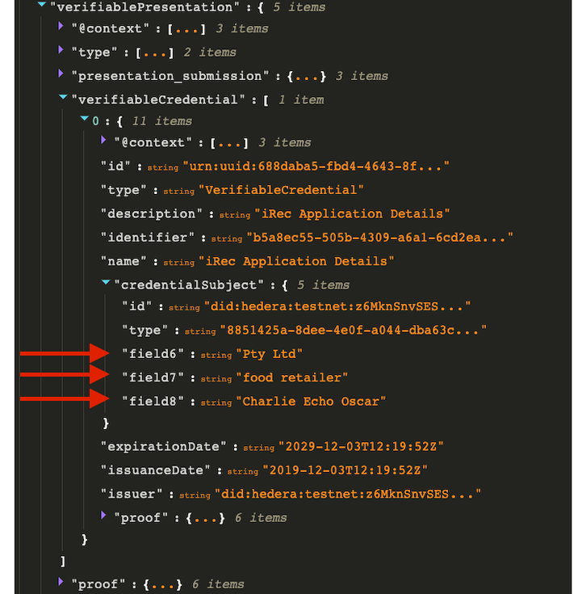

# Getting Started Guide

- [Getting Started Guide](#getting-started-guide)
- [Overview and Environment](#overview-and-environment)
  - [Participating Parties](#participating-parties)
  - [Setting Up Repositories](#setting-up-repositories)
- [Setup Data](#setup-data)
  - [Issuing Required Credentials](#issuing-required-credentials)
    - [Issuing Data Credential](#issuing-data-credential)
    - [Issuing Authorization Credential](#issuing-authorization-credential)
  - [Configuring the Responder](#configuring-the-responder)
  - [Register a Data Credential](#register-a-data-credential)
  - [Configuring the Verifier](#configuring-the-verifier)
- [Request Disclosure](#request-disclosure)
  - [Connect Hedera Account](#connect-hedera-account)
- [Appendix A](#appendix-a)
  - [Authorization Issuer DID](#authorization-issuer-did)
  - [Requester DID](#requester-did)
  - [Responder DID](#responder-did)
  - [Issuer DID](#issuer-did)
- [Appendix B](#appendix-b)
  - [Issued Verfiable Data](#issued-verfiable-data)
    - [Encrypted Data (EVC) Published](#encrypted-data-evc-published)
    - [Public Disclosed Data](#public-disclosed-data)
  - [Authorization Credential](#authorization-credential)
- [Appendix C](#appendix-c)
  - [Presentation Request](#presentation-request)
  - [Presentation Response](#presentation-response)

# Overview and Environment

In order to complete this example, we need a Hedera payer account. A Testnet account can be created by registering via the [Hedera Portal](https://portal.hedera.com/).

This document assumes you have a WalletConnect app (such as [Blade Wallet](https://bladewallet.io/)) installed with your account imported. Setting this up is outside the scope of this document.

## Participating Parties

In this example, we have a series of DIDs for each participating party. For the sake of brevity, this document will often use the last 4 characters of the DID to refer to the DID itself.

- Authorisation Issuer DID = `did:key:z6MknDUyDPK834QCtCVesmmacwFGhv8ukqbhoGao5kzzReDG` (`ReDG` for short)
- Requester DID = `did:key:z6Mks2X1aKs8PvepaGbhUghRY3pTBsjQificC4ybNnriSBSM` (`SBSM` for short)
- Responder DID = `did:key:z6MkuGB9nMVsZwJFR3WJwGBPsnjogYM5E4bvx4HFzsooFpRP` (`FpRP` for short)

We also need a DID with a BlsBbs key - in this case it is a Hedera DID;

- Data Issuer DID: `did:hedera:testnet:z6MknSnvSESWvijDEysG1wHGnaiZSLSkQEXMECWvXWnd1uaJ_0.0.1723780` (`1uaJ` for short)

For the sake of this example, the issuer will also be the subject of the data credential.

We also need a UUID for our Guardian - we will use `bd07af81-ea0e-4ef2-9846-d410a3cfcdf0` for this example.

Finally, we need at least one topic to use, or two if we want to use different topics for our data credential announcements and selective disclsoure request/response flows.

You can create topics with the `hedera-did-register` repository or write your own short script using the Hedera SDK.

See [Appendix A](#appendix-a) for full details of each DID.

## Setting Up Repositories

1. First, we need to clone the [Responder](https://github.com/Meeco/guardian-sd-responder) and set it up. Exact install and configuration details can be found in the README.

2. We also need to clone and setup the [Verifier](https://github.com/Meeco/guardian-sd-responder). Exact install details can be found in the README. This document will cover configuration.

3. Additionally need a DID resolver with support for `did:hedera` and `did:key` as used in these examples; for convenience, there is a [Hedera DID Universal Resolver Mock](https://github.com/Meeco/hedera-did-universal-resolver-mock) that can be used. Install and setup details can be found in the README.

# Setup Data

## Issuing Required Credentials

First, we need to issue our example credentials:

- a data credential that will be used for selective disclosure, and
- a credential for the authorization of the verifier.

### Issuing Data Credential

The `guardian-sd-credential-issue-example` repository can create a example data credential that will be used for selective disclosure.

Run

```shell
yarn issueAndEncrypt
```

and follow the prompts to issue our credential to `1uaJ` (as `1uaJ`):

```
? Enter Subject DID did:hedera:testnet:z6MknSnvSESWvijDEysG1wHGnaiZSLSkQEXMECWvXWnd1uaJ_0.0.1723780
? Enter Issuer DID did:hedera:testnet:z6MknSnvSESWvijDEysG1wHGnaiZSLSkQEXMECWvXWnd1uaJ_0.0.1723780
? Enter key id/fragment did-root-key-bbs
? Enter Issuer Bls public key (hex) 83022719519feec03d53fa546c2bdd9a8d4fbef8e72cf583a377a05c8386b552d184f38c8dfd7bc198ce7c89116a9cdb0352929966a9c1c7a2fcb2eb037b76580583d1aa9ae895c4b495886d8c1f07d79bf0430a8e9fcb853d557d3e167b99b9
? Enter Issuer Bls private key (hex) 155d6d9b748f7cb1b6c697ee903efe6dd0b8632f8f029da16ed43e4db2b12dce
```

Note the passphrase details and disclosed IPFS CID we will need to pass to our responder:

```
Encrypted Passphrase: Aes256Gcm.TX7OKlFpgW2Pvb6FaisLtHmDPBLEMt7EEpx9qWzj5EXd9W8f7sQV55_4m_Yw9gV1wbi-9P_rvSJzb7CAqvKthr2VR2f_tf5tT7YID3QkfWdoEXKY1hD25a3TZ8soO8yl.QUAAAAAFaXYADAAAAADebqcpqIH2XqWfxrAFYXQAEAAAAAD8TUEtifxmd4yaP161V7vyAmFkAAUAAABub25lAAA=.Pbkdf2Hmac.S0EAAAAFaXYAFAAAAABufNROtKnYY8PqCxjThVHOjrtfVxBpADpVAAAQbAAgAAAAAmhhc2gABwAAAFNIQTI1NgAA
Passphrase Encryption Key: 02f7d51294a8e2e5edccfaa6ce1cc8ff96e04fbba04382615e0a857511eaa5ab3cddc18c8f49e48851e7293882afecf8
Encrypted credential IPFS CID: bafybeiaxu5au6fg63aifihinbigkqp5r66u7tqfomlgsz44sher4ubjlki/credential.json
Disclosed credential IPFS CID: bafybeihx7w4tlwgtaiogi7axf2vlryeoapyjyjth6g7bdxpcm5sj2o2y54/disclosed-credential.json
```

as well as the `id` of the credential output

```
// ...
  "id": "urn:uuid:1e3f761f-0b11-4388-ba13-4750480ce65f",
// ...
```

### Issuing Authorization Credential

We can also use the same repository to issue our authorization credential to the requestor:

Run `yarn issueAuth` and follow the prompts to issue as `ReDG` to the requestor `SBSM`:

```
? Enter Subject DID did:key:z6Mks2X1aKs8PvepaGbhUghRY3pTBsjQificC4ybNnriSBSM
? Enter Issuer DID did:key:z6MknDUyDPK834QCtCVesmmacwFGhv8ukqbhoGao5kzzReDG
? Enter key id/fragment (leave blank if did:key to use the did key)
? Enter Issuer Ed25519 public key (base58) 8mDvd94ghWujmhexCCojmqhGtLs4LxMM7FfsFV2yWRRt
? Enter Issuer Ed25519 private key (base58) fLtQysheMS1HPEKkwsaS91vtv7CbQwMQhSjjyMNuFqvvm4YNNTJ9ZdFHobvQwZM3bR6HqUXNir8aRK5gf9hYBJJ
```

Save the issued credential to a json file for later use later.

Appendix B has the credentials used in this example.

## Configuring the Responder

We should now have everything we need to configure our responder. In the root of the responder, copy the `config.example.json` to create our `config.json` and fill in the details:

Note, base58 to hex conversion can be done [online here](https://appdevtools.com/base58-encoder-decoder).

```jsonc
{
  "responder": {
    "did": "did:key:z6MkuGB9nMVsZwJFR3WJwGBPsnjogYM5E4bvx4HFzsooFpRP", // Our 'FpRP' responder DID
    "hedera_network": "testnet",
    "edsa_key_config": {
      "id": "did:key:z6MkuGB9nMVsZwJFR3WJwGBPsnjogYM5E4bvx4HFzsooFpRP#z6MkuGB9nMVsZwJFR3WJwGBPsnjogYM5E4bvx4HFzsooFpRP",
      "type": "Ed25519VerificationKey2018",
      "controller": "did:key:z6MkuGB9nMVsZwJFR3WJwGBPsnjogYM5E4bvx4HFzsooFpRP",
      "public_key_hex": "dc0861d6915b3f2b1331b31e7e1f89b169c21584458d423af11f8fe6f56209f2", // 'FpRP' publicKeyBase58 as hex
      "private_key_hex": "25997732c614904e733ca43847b5944621c1d29ef57627ebe818307eab35c017dc0861d6915b3f2b1331b31e7e1f89b169c21584458d423af11f8fe6f56209f2" // 'FpRP' privateKeyBase58 as hex
    },
    "payer_account_id": "X.X.XXX", // Use your payer account id
    "payer_account_public_key": "abcd1234", // Use your payer account public key - this is the DER encoded ED25519 private key from the Hedera portal
    "payer_account_private_key": "abcd1234", // Use your payer account private key - this is the DER encoded ED25519 public key from the Hedera portal
    "hedera_encryption_private_key_hex": "abcd1234", // Use the one for your payer account - Use the Hex encoded ED25519 private key from the Hedera portal for this example
    "topic_ids": ["Y.Y.YYY"], // Use a topic you created
    "log_level": "info"
  },
  "guardians": [
    {
      "id": "bd07af81-ea0e-4ef2-9846-d410a3cfcdf0", // Our guardian UUID
      "passphrase_encryption_key": "c59b4791957076a276b128877e1ad7e353ab65a10e9c368d26c9fea19e7e0ed459ec21397e8e44f5c108d30ac375505b", // Generated when we created our credential above
      "topic_ids": ["Z.Z.ZZZ"], // Use a topic you created - can be the same or different as above
      "issued_credentials": [
        {
          "credential_type": "VerifiableCredential",
          "accepted_authorization_credentials": [
            {
              "credential_type": "VerifiableCredential",
              "accepted_issuer_dids": [
                "did:key:z6MknDUyDPK834QCtCVesmmacwFGhv8ukqbhoGao5kzzReDG" // Our `ReDG` authorization issuer.
              ]
            }
          ]
        }
      ]
    }
  ]
}
```

Once configured, we can start the responder; `yarn start`.

## Register a Data Credential

We need to register the encrypted credential that we made with the guardian.
To do this, we can run the responder script `yarn register` in a new terminal and fill in details as prompted from the steps we completed above:

```
? Would you like to immediately register the credential (skip HCS message)? No
? ID/URN of the verifiable credential urn:uuid:688daba5-fbd4-4643-8f9e-eb11289f5cfb
? IPFS CID of the encrypted credential bafybeiaxu5au6fg63aifihinbigkqp5r66u7tqfomlgsz44sher4ubjlki/credential.json
? Encrypted passphrase Aes256Gcm.TX7OKlFpgW2Pvb6FaisLtHmDPBLEMt7EEpx9qWzj5EXd9W8f7sQV55_4m_Yw9gV1wbi-9P_rvSJzb7CAqvKthr2VR2f_tf5tT7YID3QkfWdoEXKY1hD25a3TZ8soO8yl.QUAAAAAFaXYADAAAAADebqcpqIH2XqWfxrAFYXQAEAAAAAD8TUEtifxmd4yaP161V7vyAmFkAAUAAABub25lAAA=.Pbkdf2Hmac.S0EAAAAFaXYAFAAAAABufNROtKnYY8PqCxjThVHOjrtfVxBpADpVAAAQbAAgAAAAAmhhc2gABwAAAFNIQTI1NgAA
? Guardian ID (default is first configured guardian) bd07af81-ea0e-4ef2-9846-d410a3cfcdf0
? Topic ID for the message (default is the first topic for the selected guardian) Z.ZZ.ZZZ (YourTopic)
```

After a brief period, we should see the credential register in the logs of our responder

```
Registered new credential "urn:uuid:688daba5-fbd4-4643-8f9e-eb11289f5cfb"
```

_Note_ - if you would rather skip HCS and just register the credential immediately, you can select "Yes" in the first step.

## Configuring the Verifier

We can now configure our verifier using our prepared details:

```
# Hedera account details from the Hedera Portal
REACT_APP_HEDERA_PRIVATE_KEY=YourHederaPrivateKey
REACT_APP_HEDERA_PUBLIC_KEY=YourHederaPublicKey

REACT_APP_TOPIC_ID=Y.Y.YYY # (your topic created earlier)

# Hedera's mirror node REST API Url
REACT_APP_MIRROR_NODE_URL=https://testnet.mirrornode.hedera.com
```

We are now ready to start the verifier.

# Request Disclosure

## Connect Hedera Account

In the verifier, we first need to connect our Hedera Account. In the verifier, hit the "Wallet Connect" button.



Scan the QR code with your wallet connect app and confirm the connection.
Once complete, the verifier app will show as Connected to the hedera account.



Select "Next" to proceed to the identity section and then select the saved authorization credential json file:



Select "Get Verification Method(s)" to get the verification methods for the DID of the authorization credential.
Select the desired key and then enter the hex private key for the selected key (for the verifier - `SBSM` in our case).
_Note_ the entered private key will need to be converted to hex - in our case from base58.
The key should show as "Verified" if entered correctly:



Select "Next" to proceed to the VC Query section. Enter the IPFS CID of the public credential (our test example is `bafybeihx7w4tlwgtaiogi7axf2vlryeoapyjyjth6g7bdxpcm5sj2o2y54/disclosed-credential.json`) and select "Get VC". This show the ID of the VC:



Select "Query Responders". This will prompt for signing confirmation on your Wallet Connect app.
Shortly after confirming, the responder should receive the query sent from the verifier and appear in the list of responders.



Select "Next" to proceed to the Disclosure Request section, then select "Get VC Schema".
This should show a list of fields available on the credential.
Select some fields and then select "Create Presentation"



Once created, select the responder and select "Send Request"



This will ask for two signing confirmations on your Wallet Connect App.
Shortly after confirming both requests, the responder should receive the request from the verifier and you will see the disclosed credential data with the selected fields.



The full request and response can be seen in Appendix C.

# Appendix A

Example DID Documents

All `did:key` examples were generated using the `did-method-key` library in the following simple script:

```javascript
const didKeyDriver = require('did-method-key').driver();
const didDocument = await didKeyDriver.generate();
console.log(JSON.stringify(didDocument, null, 2));
console.log(didDocument.keys);
```

## Authorization Issuer DID

[`did:key:z6MknDUyDPK834QCtCVesmmacwFGhv8ukqbhoGao5kzzReDG`](https://dev.uniresolver.io/1.0/identifiers/did:key:z6MknDUyDPK834QCtCVesmmacwFGhv8ukqbhoGao5kzzReDG)

```json
{
  "@context": ["https://w3id.org/did/v0.11"],
  "id": "did:key:z6MknDUyDPK834QCtCVesmmacwFGhv8ukqbhoGao5kzzReDG",
  "publicKey": [
    {
      "id": "did:key:z6MknDUyDPK834QCtCVesmmacwFGhv8ukqbhoGao5kzzReDG#z6MknDUyDPK834QCtCVesmmacwFGhv8ukqbhoGao5kzzReDG",
      "type": "Ed25519VerificationKey2018",
      "controller": "did:key:z6MknDUyDPK834QCtCVesmmacwFGhv8ukqbhoGao5kzzReDG",
      "publicKeyBase58": "8mDvd94ghWujmhexCCojmqhGtLs4LxMM7FfsFV2yWRRt"
    }
  ],
  "authentication": [
    "did:key:z6MknDUyDPK834QCtCVesmmacwFGhv8ukqbhoGao5kzzReDG#z6MknDUyDPK834QCtCVesmmacwFGhv8ukqbhoGao5kzzReDG"
  ],
  "assertionMethod": [
    "did:key:z6MknDUyDPK834QCtCVesmmacwFGhv8ukqbhoGao5kzzReDG#z6MknDUyDPK834QCtCVesmmacwFGhv8ukqbhoGao5kzzReDG"
  ],
  "capabilityDelegation": [
    "did:key:z6MknDUyDPK834QCtCVesmmacwFGhv8ukqbhoGao5kzzReDG#z6MknDUyDPK834QCtCVesmmacwFGhv8ukqbhoGao5kzzReDG"
  ],
  "capabilityInvocation": [
    "did:key:z6MknDUyDPK834QCtCVesmmacwFGhv8ukqbhoGao5kzzReDG#z6MknDUyDPK834QCtCVesmmacwFGhv8ukqbhoGao5kzzReDG"
  ],
  "keyAgreement": [
    {
      "id": "did:key:z6MknDUyDPK834QCtCVesmmacwFGhv8ukqbhoGao5kzzReDG#z6LSo1QgpLBKAUcsBRBZq59k9M68GHcqFAdxvx7HNwWWQoBq",
      "type": "X25519KeyAgreementKey2019",
      "controller": "did:key:z6MknDUyDPK834QCtCVesmmacwFGhv8ukqbhoGao5kzzReDG",
      "publicKeyBase58": "CLEXJ2NT51u862ooJRdnpkseR95iYZTp3yPbtUryhRR5"
    }
  ]
}
```

```js
{
  'did:key:z6MknDUyDPK834QCtCVesmmacwFGhv8ukqbhoGao5kzzReDG#z6MknDUyDPK834QCtCVesmmacwFGhv8ukqbhoGao5kzzReDG': Ed25519KeyPair {
    passphrase: null,
    id: undefined,
    controller: 'did:key:z6MknDUyDPK834QCtCVesmmacwFGhv8ukqbhoGao5kzzReDG',
    owner: undefined,
    type: 'Ed25519VerificationKey2018',
    privateKeyBase58: 'fLtQysheMS1HPEKkwsaS91vtv7CbQwMQhSjjyMNuFqvvm4YNNTJ9ZdFHobvQwZM3bR6HqUXNir8aRK5gf9hYBJJ',
    publicKeyBase58: '8mDvd94ghWujmhexCCojmqhGtLs4LxMM7FfsFV2yWRRt'
  },
  'did:key:z6MknDUyDPK834QCtCVesmmacwFGhv8ukqbhoGao5kzzReDG#z6LSo1QgpLBKAUcsBRBZq59k9M68GHcqFAdxvx7HNwWWQoBq': X25519KeyPair {
    passphrase: null,
    id: 'did:key:z6MknDUyDPK834QCtCVesmmacwFGhv8ukqbhoGao5kzzReDG#z6LSo1QgpLBKAUcsBRBZq59k9M68GHcqFAdxvx7HNwWWQoBq',
    controller: 'did:key:z6MknDUyDPK834QCtCVesmmacwFGhv8ukqbhoGao5kzzReDG',
    owner: undefined,
    type: 'X25519KeyAgreementKey2019',
    publicKeyBase58: 'CLEXJ2NT51u862ooJRdnpkseR95iYZTp3yPbtUryhRR5',
    privateKeyBase58: 'FYc6zv34Wm22X3BdYGARU7RX9oud2jXQvACz2SrGjQUm'
  }
}
```

## Requester DID

`did:key:z6Mks2X1aKs8PvepaGbhUghRY3pTBsjQificC4ybNnriSBSM`

```json
{
  "@context": ["https://w3id.org/did/v0.11"],
  "id": "did:key:z6Mks2X1aKs8PvepaGbhUghRY3pTBsjQificC4ybNnriSBSM",
  "publicKey": [
    {
      "id": "did:key:z6Mks2X1aKs8PvepaGbhUghRY3pTBsjQificC4ybNnriSBSM#z6Mks2X1aKs8PvepaGbhUghRY3pTBsjQificC4ybNnriSBSM",
      "type": "Ed25519VerificationKey2018",
      "controller": "did:key:z6Mks2X1aKs8PvepaGbhUghRY3pTBsjQificC4ybNnriSBSM",
      "publicKeyBase58": "DaFxz5ch4PAMTmkzo7jagxGTNJTZJnUFW44fYWthWxey"
    }
  ],
  "authentication": [
    "did:key:z6Mks2X1aKs8PvepaGbhUghRY3pTBsjQificC4ybNnriSBSM#z6Mks2X1aKs8PvepaGbhUghRY3pTBsjQificC4ybNnriSBSM"
  ],
  "assertionMethod": [
    "did:key:z6Mks2X1aKs8PvepaGbhUghRY3pTBsjQificC4ybNnriSBSM#z6Mks2X1aKs8PvepaGbhUghRY3pTBsjQificC4ybNnriSBSM"
  ],
  "capabilityDelegation": [
    "did:key:z6Mks2X1aKs8PvepaGbhUghRY3pTBsjQificC4ybNnriSBSM#z6Mks2X1aKs8PvepaGbhUghRY3pTBsjQificC4ybNnriSBSM"
  ],
  "capabilityInvocation": [
    "did:key:z6Mks2X1aKs8PvepaGbhUghRY3pTBsjQificC4ybNnriSBSM#z6Mks2X1aKs8PvepaGbhUghRY3pTBsjQificC4ybNnriSBSM"
  ],
  "keyAgreement": [
    {
      "id": "did:key:z6Mks2X1aKs8PvepaGbhUghRY3pTBsjQificC4ybNnriSBSM#z6LSjbVrHy1runX9TdsXEcW4m59eBgB7R7PUsDtRUmJkwUma",
      "type": "X25519KeyAgreementKey2019",
      "controller": "did:key:z6Mks2X1aKs8PvepaGbhUghRY3pTBsjQificC4ybNnriSBSM",
      "publicKeyBase58": "8vKgmfCzpKoQNFVkhxz7SUwALXdziWDKzFAjzJfEE6zp"
    }
  ]
}
```

```js
{
  'did:key:z6Mks2X1aKs8PvepaGbhUghRY3pTBsjQificC4ybNnriSBSM#z6Mks2X1aKs8PvepaGbhUghRY3pTBsjQificC4ybNnriSBSM': Ed25519KeyPair {
    passphrase: null,
    id: undefined,
    controller: 'did:key:z6Mks2X1aKs8PvepaGbhUghRY3pTBsjQificC4ybNnriSBSM',
    owner: undefined,
    type: 'Ed25519VerificationKey2018',
    privateKeyBase58: '4VfaBVTj7UruCQHpoizMAstHdbQwiu42Ws4RJYEEgHGfsZau3P44h8PMmeVEziiztUv46CPka87yP37mz4vqKy57',
    publicKeyBase58: 'DaFxz5ch4PAMTmkzo7jagxGTNJTZJnUFW44fYWthWxey'
  },
  'did:key:z6Mks2X1aKs8PvepaGbhUghRY3pTBsjQificC4ybNnriSBSM#z6LSjbVrHy1runX9TdsXEcW4m59eBgB7R7PUsDtRUmJkwUma': X25519KeyPair {
    passphrase: null,
    id: 'did:key:z6Mks2X1aKs8PvepaGbhUghRY3pTBsjQificC4ybNnriSBSM#z6LSjbVrHy1runX9TdsXEcW4m59eBgB7R7PUsDtRUmJkwUma',
    controller: 'did:key:z6Mks2X1aKs8PvepaGbhUghRY3pTBsjQificC4ybNnriSBSM',
    owner: undefined,
    type: 'X25519KeyAgreementKey2019',
    publicKeyBase58: '8vKgmfCzpKoQNFVkhxz7SUwALXdziWDKzFAjzJfEE6zp',
    privateKeyBase58: 'amfsTXf4cSYie8PYVypECULxy5TJ2kr86iycCvPxHWm'
  }
}
```

## Responder DID

`did:key:z6MkuGB9nMVsZwJFR3WJwGBPsnjogYM5E4bvx4HFzsooFpRP`

```json
{
  "@context": ["https://w3id.org/did/v0.11"],
  "id": "did:key:z6MkuGB9nMVsZwJFR3WJwGBPsnjogYM5E4bvx4HFzsooFpRP",
  "publicKey": [
    {
      "id": "did:key:z6MkuGB9nMVsZwJFR3WJwGBPsnjogYM5E4bvx4HFzsooFpRP#z6MkuGB9nMVsZwJFR3WJwGBPsnjogYM5E4bvx4HFzsooFpRP",
      "type": "Ed25519VerificationKey2018",
      "controller": "did:key:z6MkuGB9nMVsZwJFR3WJwGBPsnjogYM5E4bvx4HFzsooFpRP",
      "publicKeyBase58": "Fov7C7FSEPonJYfcFhDZ2hBory5DpBMaG3NLAbqnLbe1"
    }
  ],
  "authentication": [
    "did:key:z6MkuGB9nMVsZwJFR3WJwGBPsnjogYM5E4bvx4HFzsooFpRP#z6MkuGB9nMVsZwJFR3WJwGBPsnjogYM5E4bvx4HFzsooFpRP"
  ],
  "assertionMethod": [
    "did:key:z6MkuGB9nMVsZwJFR3WJwGBPsnjogYM5E4bvx4HFzsooFpRP#z6MkuGB9nMVsZwJFR3WJwGBPsnjogYM5E4bvx4HFzsooFpRP"
  ],
  "capabilityDelegation": [
    "did:key:z6MkuGB9nMVsZwJFR3WJwGBPsnjogYM5E4bvx4HFzsooFpRP#z6MkuGB9nMVsZwJFR3WJwGBPsnjogYM5E4bvx4HFzsooFpRP"
  ],
  "capabilityInvocation": [
    "did:key:z6MkuGB9nMVsZwJFR3WJwGBPsnjogYM5E4bvx4HFzsooFpRP#z6MkuGB9nMVsZwJFR3WJwGBPsnjogYM5E4bvx4HFzsooFpRP"
  ],
  "keyAgreement": [
    {
      "id": "did:key:z6MkuGB9nMVsZwJFR3WJwGBPsnjogYM5E4bvx4HFzsooFpRP#z6LScPHCyUbHkBcC7ABteDQzNJAMHs2GYM3ACpr5NAUKeSiE",
      "type": "X25519KeyAgreementKey2019",
      "controller": "did:key:z6MkuGB9nMVsZwJFR3WJwGBPsnjogYM5E4bvx4HFzsooFpRP",
      "publicKeyBase58": "i73TAnReitT1mp87Zu33hwsSiV9qjs1Kr8Pshpnw4wU"
    }
  ]
}
```

```js
{
  'did:key:z6MkuGB9nMVsZwJFR3WJwGBPsnjogYM5E4bvx4HFzsooFpRP#z6MkuGB9nMVsZwJFR3WJwGBPsnjogYM5E4bvx4HFzsooFpRP': Ed25519KeyPair {
    passphrase: null,
    id: undefined,
    controller: 'did:key:z6MkuGB9nMVsZwJFR3WJwGBPsnjogYM5E4bvx4HFzsooFpRP',
    owner: undefined,
    type: 'Ed25519VerificationKey2018',
    privateKeyBase58: 'kbqK5mNS3pok2nocwyQR82u3vp3PR54E9NHpoB73TUGcdAyzPTMmVG5cqm9yk5WjRHeiVh9hYNVx3xo649SWaE5',
    publicKeyBase58: 'Fov7C7FSEPonJYfcFhDZ2hBory5DpBMaG3NLAbqnLbe1'
  },
  'did:key:z6MkuGB9nMVsZwJFR3WJwGBPsnjogYM5E4bvx4HFzsooFpRP#z6LScPHCyUbHkBcC7ABteDQzNJAMHs2GYM3ACpr5NAUKeSiE': X25519KeyPair {
    passphrase: null,
    id: 'did:key:z6MkuGB9nMVsZwJFR3WJwGBPsnjogYM5E4bvx4HFzsooFpRP#z6LScPHCyUbHkBcC7ABteDQzNJAMHs2GYM3ACpr5NAUKeSiE',
    controller: 'did:key:z6MkuGB9nMVsZwJFR3WJwGBPsnjogYM5E4bvx4HFzsooFpRP',
    owner: undefined,
    type: 'X25519KeyAgreementKey2019',
    publicKeyBase58: 'i73TAnReitT1mp87Zu33hwsSiV9qjs1Kr8Pshpnw4wU',
    privateKeyBase58: '25t6mjM2S17us8XDj7PgwVKTs33XAVU1ECPQkjxGZMcw'
  }
}
```

## Issuer DID

This was generated using the [Hedera DID IPFS Register Example](https://github.com/Meeco/hedera-did-register-ipfs-example) repository.

```
Your topic ID is: 0.0.1723780

Ed25519 Verification secret key (multibase): zrv4n4pRqhNdYDNMt4E2x9wgmLQyKbmnJ9G5xbocyKqZDqDkkt59FNDZe6vFarokRSbAbDcjVUsjnzLsXuBkEJgyo2z
Ed25519 Verification public key (multibase): z6MknSnvSESWvijDEysG1wHGnaiZSLSkQEXMECWvXWnd1uaJ


Ed25519 Verification secret key (hex): 8026cf1cd700fd2d21740c26ad9cc34464ac80c203cac04492e6599458d5a49d248b76bed3b0ff28c3676462584f9642283f7f7b7ac9a2af1a83e2c0fe3a2b71c17b
Ed25519 Verification public key (hex): ed0176bed3b0ff28c3676462584f9642283f7f7b7ac9a2af1a83e2c0fe3a2b71c17b


Bls12381G2 Verification secret key (hex): 155d6d9b748f7cb1b6c697ee903efe6dd0b8632f8f029da16ed43e4db2b12dce
Bls12381G2 Verification public key (hex): 83022719519feec03d53fa546c2bdd9a8d4fbef8e72cf583a377a05c8386b552d184f38c8dfd7bc198ce7c89116a9cdb0352929966a9c1c7a2fcb2eb037b76580583d1aa9ae895c4b495886d8c1f07d79bf0430a8e9fcb853d557d3e167b99b9


DID Document file CID: bafybeifn6wwfs355md56nhwaklgr2uvuoknnjobh2d2suzsdv6zpoxajfa/did-document.json


Your DID: did:hedera:testnet:z6MknSnvSESWvijDEysG1wHGnaiZSLSkQEXMECWvXWnd1uaJ_0.0.1723780
```

DID Document

```json
{
  "@context": "https://www.w3.org/ns/did/v1",
  "id": "did:hedera:testnet:z6MknSnvSESWvijDEysG1wHGnaiZSLSkQEXMECWvXWnd1uaJ_0.0.1723780",
  "authentication": [
    "did:hedera:testnet:z6MknSnvSESWvijDEysG1wHGnaiZSLSkQEXMECWvXWnd1uaJ_0.0.1723780#did-root-key"
  ],
  "verificationMethod": [
    {
      "id": "did:hedera:testnet:z6MknSnvSESWvijDEysG1wHGnaiZSLSkQEXMECWvXWnd1uaJ_0.0.1723780#did-root-key",
      "type": "Ed25519VerificationKey2020",
      "publicKeyMultibase": "z6MknSnvSESWvijDEysG1wHGnaiZSLSkQEXMECWvXWnd1uaJ",
      "controller": "did:hedera:testnet:z6MknSnvSESWvijDEysG1wHGnaiZSLSkQEXMECWvXWnd1uaJ_0.0.1723780"
    },
    {
      "id": "did:hedera:testnet:z6MknSnvSESWvijDEysG1wHGnaiZSLSkQEXMECWvXWnd1uaJ_0.0.1723780#did-root-key-bbs",
      "type": "Bls12381G2Key2020",
      "controller": "did:hedera:testnet:z6MknSnvSESWvijDEysG1wHGnaiZSLSkQEXMECWvXWnd1uaJ_0.0.1723780",
      "publicKeyBase58": "n8VJogGEu25pyGhxNePPoPXE4YZneVrzd2ReLrYWCCKmCpn7CVU7zf3iU5rS1iyqoM427dP3ncBkZctXTsP5yV6Kn76xJAToSkSHgt5RNUu3yMayMsiLrB7PFiNsnfZUMtc"
    }
  ],
  "assertionMethod": ["#did-root-key", "#did-root-key-bbs"]
}
```

# Appendix B

Sample Data documents.

## Issued Verfiable Data

```json
{
  "@context": [
    "https://www.w3.org/2018/credentials/v1",
    "https://w3id.org/security/suites/bls12381-2020/v1",
    "https://ipfs.io/ipfs/bafybeibczltbc2wewlowwd3yv5tpdd55va7agxc557tzxljao44owx4d3a/8851425a-8dee-4e0f-a044-dba63cf84eb2.json"
  ],
  "id": "urn:uuid:688daba5-fbd4-4643-8f9e-eb11289f5cfb",
  "type": ["VerifiableCredential"],
  "issuer": "did:hedera:testnet:z6MknSnvSESWvijDEysG1wHGnaiZSLSkQEXMECWvXWnd1uaJ_0.0.1723780",
  "identifier": "b5a8ec55-505b-4309-a6a1-6cd2ea270d71",
  "name": "iRec Application Details",
  "description": "iRec Application Details",
  "issuanceDate": "2019-12-03T12:19:52Z",
  "expirationDate": "2029-12-03T12:19:52Z",
  "credentialSubject": {
    "id": "did:hedera:testnet:z6MknSnvSESWvijDEysG1wHGnaiZSLSkQEXMECWvXWnd1uaJ_0.0.1723780",
    "type": "8851425a-8dee-4e0f-a044-dba63cf84eb2&1.0.0",
    "field0": "Example Company",
    "field1": "10000",
    "field2": "H0170966",
    "field3": "255 345 345",
    "field4": "AU",
    "field5": "2022-10-13",
    "field6": "Pty Ltd",
    "field7": "food retailer",
    "field8": "Charlie Echo Oscar",
    "field9": "6",
    "field10": "2001",
    "field11": "contact@example.com",
    "field12": "Peter Charlie",
    "field13": "0411111111",
    "field14": "1 Main Street",
    "field15": "registrant",
    "field16": "http://exmple.com ",
    "field17": "9",
    "policyId": "627903aa8b28bf6e0ae7bbca"
  },
  "proof": {
    "type": "BbsBlsSignature2020",
    "created": "2023-09-14T05:42:28Z",
    "proofPurpose": "assertionMethod",
    "proofValue": "ku84MFvzs7/79YTEJiWg2m+lZsTc/bzTPqI4U1jGRKxQPBUFje4DuCXjddk4DLbxYUHlKfzccE4m7waZyoLEkBLFiK2g54Q2i+CdtYBgDdkUDsoULSBMcH1MwGHwdjfXpldFNFrHFx/IAvLVniyeMQ==",
    "verificationMethod": "did:hedera:testnet:z6MknSnvSESWvijDEysG1wHGnaiZSLSkQEXMECWvXWnd1uaJ_0.0.1723780#did-root-key-bbs"
  }
}
```

### Encrypted Data (EVC) Published

- Encrypted credential IPFS CID: [`bafybeiaxu5au6fg63aifihinbigkqp5r66u7tqfomlgsz44sher4ubjlki/credential.json`](https://ipfs.io/ipfs/bafybeiaxu5au6fg63aifihinbigkqp5r66u7tqfomlgsz44sher4ubjlki/credential.json)
  - Passphrase: `0a4af9ed7b9f0cc8a14b270cecf57045734b648a3aee5acb18227cb113c44ba6f1fbc8692d34b8e2993e5bf2f2049afc`
  - Encrypted Passphrase: `Aes256Gcm.TX7OKlFpgW2Pvb6FaisLtHmDPBLEMt7EEpx9qWzj5EXd9W8f7sQV55_4m_Yw9gV1wbi-9P_rvSJzb7CAqvKthr2VR2f_tf5tT7YID3QkfWdoEXKY1hD25a3TZ8soO8yl.QUAAAAAFaXYADAAAAADebqcpqIH2XqWfxrAFYXQAEAAAAAD8TUEtifxmd4yaP161V7vyAmFkAAUAAABub25lAAA=.Pbkdf2Hmac.S0EAAAAFaXYAFAAAAABufNROtKnYY8PqCxjThVHOjrtfVxBpADpVAAAQbAAgAAAAAmhhc2gABwAAAFNIQTI1NgAA`
  - Passphrase Encryption Key: `02f7d51294a8e2e5edccfaa6ce1cc8ff96e04fbba04382615e0a857511eaa5ab3cddc18c8f49e48851e7293882afecf8`

### Public Disclosed Data

- Disclosed data verifiable credential IPFS CID: [`bafybeihx7w4tlwgtaiogi7axf2vlryeoapyjyjth6g7bdxpcm5sj2o2y54/disclosed-credential.json`](https://ipfs.io/ipfs/bafybeihx7w4tlwgtaiogi7axf2vlryeoapyjyjth6g7bdxpcm5sj2o2y54/disclosed-credential.json)

```json
{
  "@context": [
    "https://www.w3.org/2018/credentials/v1",
    "https://w3id.org/security/suites/bls12381-2020/v1",
    "https://ipfs.io/ipfs/bafybeibczltbc2wewlowwd3yv5tpdd55va7agxc557tzxljao44owx4d3a/8851425a-8dee-4e0f-a044-dba63cf84eb2.json"
  ],
  "id": "urn:uuid:688daba5-fbd4-4643-8f9e-eb11289f5cfb",
  "type": "VerifiableCredential",
  "description": "iRec Application Details",
  "identifier": "b5a8ec55-505b-4309-a6a1-6cd2ea270d71",
  "name": "iRec Application Details",
  "credentialSubject": {
    "id": "did:hedera:testnet:z6MknSnvSESWvijDEysG1wHGnaiZSLSkQEXMECWvXWnd1uaJ_0.0.1723780",
    "type": "8851425a-8dee-4e0f-a044-dba63cf84eb2&1.0.0",
    "field0": "Example Company"
  },
  "expirationDate": "2029-12-03T12:19:52Z",
  "issuanceDate": "2019-12-03T12:19:52Z",
  "issuer": "did:hedera:testnet:z6MknSnvSESWvijDEysG1wHGnaiZSLSkQEXMECWvXWnd1uaJ_0.0.1723780",
  "proof": {
    "type": "BbsBlsSignatureProof2020",
    "created": "2023-09-14T05:42:28Z",
    "nonce": "acIxrWsm0jRMrpz5+qRIemgYoOAdCTZQO91+bW2uCla849pYaiOP2pAoLSFIM2mO5Z0=",
    "proofPurpose": "assertionMethod",
    "proofValue": "ACAA/4AAH5npXC3mhX5IN3CLldBfHDkCijVbaB10Bpo/YMolhGvG0b5ki/BTi4NLGW19krmLXKwqSQbEr7PZfoWvz248daU1yRF1FoAXq3HCzIRK3Cl1Ok8l6AWJA34EYiR9KMvKKJcbltVa7BED8cL5SkhVPIMuqlcf725gBHcHwnUCXLTVtxtfWQ27CGaAMo3FKHaBRAAAAHSpw90DcqoBCbQAGEMfKD30VSyVQtKfqOk558N1LyxDk+mOqonOH260nXaqORq+3KQAAAACN4KmWlN1qtfnFksoYZBSqs9UaN11tbmm5RwIQ2L042NAgxV4ejEIECl3qOxdufL/15Tfi0Im2iki2wuRrshO/KlODIorpzUqXLiEa2bce4g9ghjiuTiKpLqfsgWQmnXSL9l2aBJXHw6FcZ/c1zrb2wAAABQqRMwd+A2+8be7ptF3srBBpnqxJTDGvxZbV6Y1sO6FkU8uZK5Q9wpOzrEvVTf7jtIsdK6tVKa/Rk0PSr1IeCOdMh8KuWoaJw6emNdzlntCH+6fmkSi17P9Kx75ToSP4qo1+4nMVgqAMzuXlBRILAmR96SFEUAzESRJJxjSt7dxA25fmp3yZEkAySUWda95Zsq9nI8NmYCV52QkXktdMoT4OxRFkm5ZBSFzvQlHNm1KETmMXL3oPSZhLBgsfePvSDItWFcetRcSDz1Vx5LsUEql5s0n2gf7M/bf9F5wNKVofE/cwgdXz1jEIxz8hq40wXWlLmQlQepYEHsdpyxG14hxFbPyc+aARnBQWI2hUMKMeiXaPBBkM3y2XyZQXaYPG5ICH6t/huP1QW7mpseUVV6vxyigPWyPH6bcYD2rDtkBZUqxmumUrkjR2bUbp0sdrRnpi5MaQlWhlSXMSitapgQYLWYcCpfBD09wEuV6I8XtL1HJJ6ooBLhggPRt+zNfSBRisa7L/D8mLjHu/bPs02eesMmBiZ8kAjqNhuAffyGoLnFXFOWfj/LNXxmU5xcl/LPVBTiq0wQ6t0gwz3hp2q9aDH1Y24v4ZpG0AEM6OazdMi+QqpWwN/EMgOW4c6RudS5KrB+O7bBOwFAW+V4KogLY/K9pn69ykLwDEiOi/V7bxBWTsv/Qn56dKGMat/0nECymmvWTGjz5tisf1wFNTK0VNolpJnq0i83sXMDHssaPVxufIY+0oghDYrMC/vCPriRTxR3QSOGVHd5rD4/1jn4wHefgubV0Pla8H9SeggdtxmJXvg6hTo7SBSO8C8dDR8vi8KStjqaWDlagkRqzgjIF",
    "verificationMethod": "did:hedera:testnet:z6MknSnvSESWvijDEysG1wHGnaiZSLSkQEXMECWvXWnd1uaJ_0.0.1723780#did-root-key-bbs"
  }
}
```

## Authorization Credential

```json
{
  "@context": [
    "https://www.w3.org/2018/credentials/v1",
    "https://www.w3.org/2018/credentials/examples/v1"
  ],
  "id": "http://example.edu/credentials/1872",
  "type": ["VerifiableCredential", "AlumniCredential"],
  "issuer": "did:key:z6MknDUyDPK834QCtCVesmmacwFGhv8ukqbhoGao5kzzReDG",
  "issuanceDate": "2010-01-01T19:23:24Z",
  "credentialSubject": {
    "id": "did:key:z6Mks2X1aKs8PvepaGbhUghRY3pTBsjQificC4ybNnriSBSM",
    "alumniOf": "<span lang=\"en\">Example University</span>"
  },
  "proof": {
    "type": "Ed25519Signature2018",
    "created": "2023-09-14T02:02:38Z",
    "verificationMethod": "did:key:z6MknDUyDPK834QCtCVesmmacwFGhv8ukqbhoGao5kzzReDG#z6MknDUyDPK834QCtCVesmmacwFGhv8ukqbhoGao5kzzReDG",
    "proofPurpose": "assertionMethod",
    "jws": "eyJhbGciOiJFZERTQSIsImI2NCI6ZmFsc2UsImNyaXQiOlsiYjY0Il19..ySvzGk3iXkvw5CsjpHMzAVKZFD2mrfkWuMIQHlvDzleL17Qf558a9nLq2Ul5WVXB0GHGqe5wFN6zwfFoulGXDg"
  }
}
```

# Appendix C

Example Selective Disclosure flow documents.

## Presentation Request

```json
{
  "comment": "Note: VP, OIDC, DIDComm, or CHAPI outer wrapper would be here.",
  "presentation_definition": {
    "id": "54f38442-45c4-4372-84ad-41dc5ae14f1c",
    "input_descriptors": [
      {
        "id": "audit",
        "name": "Audit Report Request",
        "purpose": "Require further information to complete audit report.",
        "constraints": {
          "fields": [
            {
              "path": ["$.id"],
              "filter": {
                "type": "string",
                "const": "urn:uuid:688daba5-fbd4-4643-8f9e-eb11289f5cfb"
              }
            },
            {
              "path": [
                "$.credentialSubject.field6",
                "$.credentialSubject.field7",
                "$.credentialSubject.field8"
              ]
            }
          ]
        }
      }
    ]
  },
  "authorization_details": {
    "verifiablePresentation": {
      "@context": [
        "https://www.w3.org/2018/credentials/v1",
        "https://w3id.org/security/suites/ed25519-2020/v1"
      ],
      "type": ["VerifiablePresentation"],
      "verifiableCredential": [
        {
          "@context": [
            "https://www.w3.org/2018/credentials/v1",
            "https://www.w3.org/2018/credentials/examples/v1"
          ],
          "id": "http://example.edu/credentials/1872",
          "type": ["VerifiableCredential", "AlumniCredential"],
          "issuer": "did:key:z6MknDUyDPK834QCtCVesmmacwFGhv8ukqbhoGao5kzzReDG",
          "issuanceDate": "2010-01-01T19:23:24Z",
          "credentialSubject": {
            "id": "did:key:z6Mks2X1aKs8PvepaGbhUghRY3pTBsjQificC4ybNnriSBSM",
            "alumniOf": "<span lang=\"en\">Example University</span>"
          },
          "proof": {
            "type": "Ed25519Signature2018",
            "created": "2023-09-14T02:02:38Z",
            "verificationMethod": "did:key:z6MknDUyDPK834QCtCVesmmacwFGhv8ukqbhoGao5kzzReDG#z6MknDUyDPK834QCtCVesmmacwFGhv8ukqbhoGao5kzzReDG",
            "proofPurpose": "assertionMethod",
            "jws": "eyJhbGciOiJFZERTQSIsImI2NCI6ZmFsc2UsImNyaXQiOlsiYjY0Il19..ySvzGk3iXkvw5CsjpHMzAVKZFD2mrfkWuMIQHlvDzleL17Qf558a9nLq2Ul5WVXB0GHGqe5wFN6zwfFoulGXDg"
          }
        }
      ],
      "id": "urn:uuid:938abcf1-4e1d-4a68-bebc-e36fe7b56169",
      "holder": "did:key:z6Mks2X1aKs8PvepaGbhUghRY3pTBsjQificC4ybNnriSBSM",
      "proof": {
        "type": "Ed25519Signature2020",
        "created": "2023-09-15T00:31:09Z",
        "verificationMethod": "did:key:z6Mks2X1aKs8PvepaGbhUghRY3pTBsjQificC4ybNnriSBSM#z6Mks2X1aKs8PvepaGbhUghRY3pTBsjQificC4ybNnriSBSM",
        "proofPurpose": "authentication",
        "challenge": "challenge",
        "proofValue": "z2nKBqVuDgq6uzTtNhqQVMe4HLj2K2g4D9Jzo2oeQxA4G8H5HV2McEF2bHdrGZry6oHKqoP4n8MGjS45BERTwbR6H"
      }
    },
    "did": "did:key:z6Mks2X1aKs8PvepaGbhUghRY3pTBsjQificC4ybNnriSBSM"
  }
}
```

## Presentation Response

```json
{
  "verifiablePresentation": {
    "@context": [
      "https://www.w3.org/2018/credentials/v1",
      "https://identity.foundation/presentation-exchange/submission/v1",
      "https://w3id.org/security/suites/ed25519-2020/v1"
    ],
    "type": ["VerifiablePresentation", "PresentationSubmission"],
    "presentation_submission": {
      "id": "kPvF9zHmlGOZ2t3FGwuG_",
      "definition_id": "54f38442-45c4-4372-84ad-41dc5ae14f1c",
      "descriptor_map": [
        {
          "id": "audit",
          "format": "ldp_vc",
          "path": "$.verifiableCredential[0]"
        }
      ]
    },
    "verifiableCredential": [
      {
        "@context": [
          "https://www.w3.org/2018/credentials/v1",
          "https://w3id.org/security/suites/bls12381-2020/v1",
          "https://ipfs.io/ipfs/bafybeibczltbc2wewlowwd3yv5tpdd55va7agxc557tzxljao44owx4d3a/8851425a-8dee-4e0f-a044-dba63cf84eb2.json"
        ],
        "id": "urn:uuid:688daba5-fbd4-4643-8f9e-eb11289f5cfb",
        "type": "VerifiableCredential",
        "description": "iRec Application Details",
        "identifier": "b5a8ec55-505b-4309-a6a1-6cd2ea270d71",
        "name": "iRec Application Details",
        "credentialSubject": {
          "id": "did:hedera:testnet:z6MknSnvSESWvijDEysG1wHGnaiZSLSkQEXMECWvXWnd1uaJ_0.0.1723780",
          "type": "8851425a-8dee-4e0f-a044-dba63cf84eb2&1.0.0",
          "field6": "Pty Ltd",
          "field7": "food retailer",
          "field8": "Charlie Echo Oscar"
        },
        "expirationDate": "2029-12-03T12:19:52Z",
        "issuanceDate": "2019-12-03T12:19:52Z",
        "issuer": "did:hedera:testnet:z6MknSnvSESWvijDEysG1wHGnaiZSLSkQEXMECWvXWnd1uaJ_0.0.1723780",
        "proof": {
          "type": "BbsBlsSignatureProof2020",
          "created": "2023-09-14T05:42:28Z",
          "nonce": "PtrFqKtepg+utvlBvlGkhMD8QFn8Je/+6GlMQE9QPlXNoZpFEwg4mp8D6yf6Veu9CS8=",
          "proofPurpose": "assertionMethod",
          "proofValue": "ACAA/5wAD6U2BLZ6mOi8EzBIlfRmqDYbbW8PD1anPjNwZF2UZgqlqYEWUDvNrf5Zfc7rnqvCwbiH98CB6gAJJrqPI0eSS+PnBa6AgcQq2mBqjjFiT9q1+xdcxhxw8U8caiTDHvet8qm/uscYYoF0OJ9oOmHKw/2OxiA16PEn3PXwdJRb4njhtU6w+LumpHufE0gn4w30twAAAHSo/TOZyXins/FoRi94DvQSHDi3woD/GK4bXI81uELMgA+Be0Og25hCfcNaFtgRRE8AAAACImopI21LyorNgRAdm+V18uD5y8yUXEouHzr7CyhS/6MLKGrisggHZ+nkurufjzsmQyC6bafdmOP6fzs8QMN/SbiXdJW/rrOyQII79IK7o3/gpdyV1E2YRU2Sq5pV4Wi2PilFSu1iXCHRCvWtK2e3XwAAABJdNgrrrFlhNO1ua1vnDJa5DSetezNzKsx60eZkAdj+ah7wbBzAH7ZaG3fQnNXyXoMb/hc58ArnWM00CPpT5IT9B5ej6puyQo/Q+xSOrS8b3hh8LduVHxCDrC3Ia0ULrhUAd9aHBZlnaZzzFrcFH/pzf8K7lzXnQv+lWmy0+4RAtz1tlNKPl4bBWUEaS80fM+cFkN5iwqilioeZSy0nNvbwU0SpnFzbMTtTysH6d7FHkooRk1P4yK6Q1au+O9iD9PEMpCkG0W45ZdJophdkdP78AZkVltUNN+6F+ehZ3PPW0jEn/4mV7mS1RCrwA65c1unELYpUVqdeg4/twB57tIj2MhCktdvU4xEoHV1n+5mQKHO3iUhdwaFWQTwG9T79eWVeIKmuHXXMlsNl3H1J5likDoXvIUQKm3AMAgHZ+9miskbdqlrkPpkNI1DScXru6ERMVYx3bp8AQNl63wUaxkCnObJsuLPxBcbX1D62dU2m2oFY4SgVqx1gIX3krcZJJhxr5+sV/eOFxcXrenKAb1fKu7sT2NXtyA7fjBne0s5YekI8dQ6iOof3zobor6/dsy0TPbuZbgtGgbYxhM1/i2hvB5QZVXyLuXrmH5zMfJHRMxaQ6nrET4jQ6VLdypVKzhUIaAaO9U07VPPJG9yXUvVgXfYRiOoHji4Lfa80FIxvTBvOPW7avOKjfy/qHc3sxNjJg9LkK9ch2VOwSE4F/E7mTd50VG3c24BTV274+BuWrW8LCkjTBCiz2C68WOzK5pE=",
          "verificationMethod": "did:hedera:testnet:z6MknSnvSESWvijDEysG1wHGnaiZSLSkQEXMECWvXWnd1uaJ_0.0.1723780#did-root-key-bbs"
        }
      }
    ],
    "proof": {
      "type": "Ed25519Signature2020",
      "created": "2023-09-15T00:31:44Z",
      "verificationMethod": "did:key:z6MkuGB9nMVsZwJFR3WJwGBPsnjogYM5E4bvx4HFzsooFpRP#z6MkuGB9nMVsZwJFR3WJwGBPsnjogYM5E4bvx4HFzsooFpRP",
      "proofPurpose": "authentication",
      "challenge": "1694737898.189146691",
      "proofValue": "z4zUQXKdmwmGgrjVfiRLWdriCKcihk8XC5onHmfpLYuswwP8Xvcdpx6HTgHcnMaEMtZRxYTeFPDCivEHeHSS2bZi6"
    }
  },
  "presentationSubmissionLocation": 1,
  "presentationSubmission": {
    "id": "kPvF9zHmlGOZ2t3FGwuG_",
    "definition_id": "54f38442-45c4-4372-84ad-41dc5ae14f1c",
    "descriptor_map": [
      {
        "id": "audit",
        "format": "ldp_vc",
        "path": "$.verifiableCredential[0]"
      }
    ]
  }
}
```
